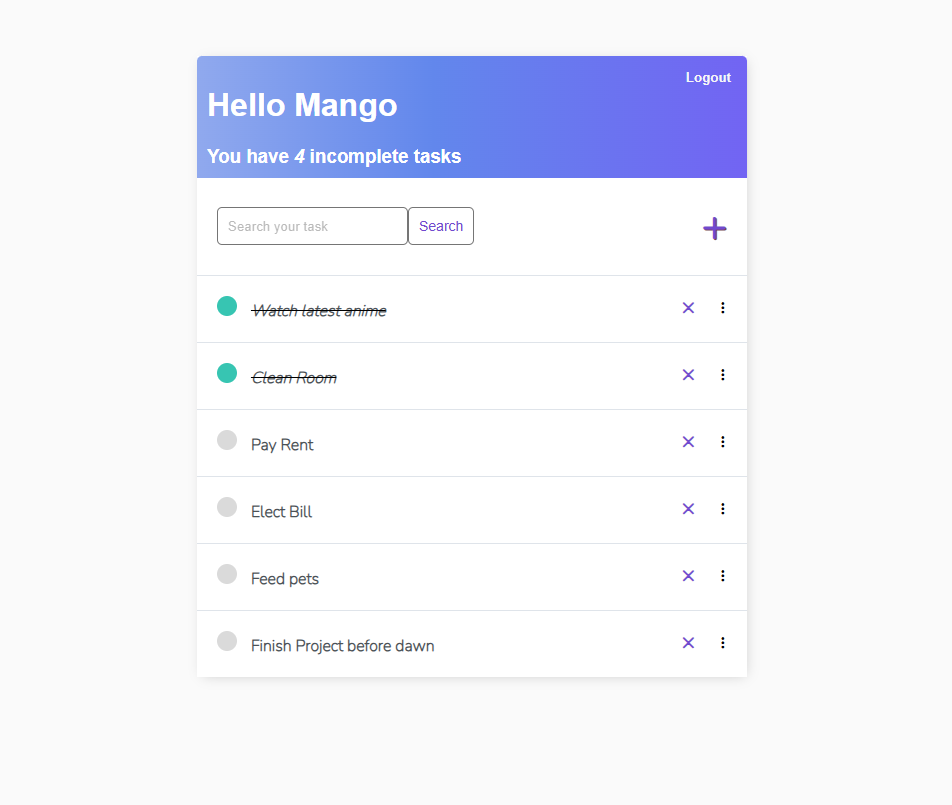

# 🗒️ Django Todo List

A simple task management web app built using Django. Users can create, update, delete, and view their to-do items. Includes user authentication to ensure tasks are personalized per user.

---

## 🚀 Features

- 🧑‍💻 User Authentication (Login & Logout)
- ✅ Create / Read / Update / Delete tasks
- 📊 Task completion and remaining counters
- 🎨 Clean and User-friendly UI
- 🛠️ Admin panel to manage tasks and users

---

## 📸 UI Design 




---

## 🛠️ Tech Stack

- **Backend:** Django (Python)
- **Frontend:** HTML, CSS (with custom styles)
- **Database:** SQLite (default)
- **Admin Panel:** Enabled

---

## 📂 Project Structure

```text
Django_Todo-list/
├── base/               # Core app (models, views, templates)
│   ├── templates/
│   └── static/
├── todo_list/          # Project config (settings, urls)
├── db.sqlite3          # SQLite DB
├── manage.py
└── README.md

## 💻 How to Run Locally

Follow these steps to get the project running on your local machine:

---

### 1. 🧬 Clone the Repository

```bash
git clone https://github.com/your-username/Django_Todo-list.git
cd Django_Todo-list
